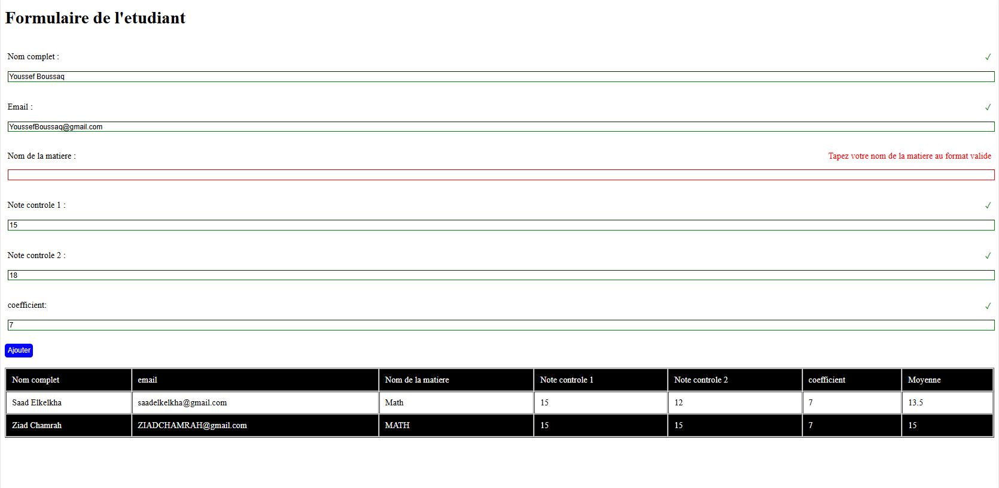

# Student-Grade-Management

### Project Description:
The Student Grade Management project is a web-based application that allows users to input and manage student grades for different subjects. It features form validation and dynamically updates a table with student data. The project uses HTML, CSS, and JavaScript to provide a seamless user experience.

#### File: `index.php`

### Description:
This HTML file contains a form for entering student details and grades, along with a table to display the entered information. The form fields include student name, email, subject name, and two grades. It uses JavaScript to validate the input data and ensure it meets specific criteria before adding it to the table.

#### Key Features:
- **Student Name Validation**: Ensures the name is in the format "Firstname Lastname" with capitalized initials.
- **Email Validation**: Checks if the email follows a standard email format.
- **Subject Name Validation**: Ensures the subject name contains only letters and spaces.
- **Grade Validation**: Ensures the grades are numbers between 0 and 20.
- **Coefficient Validation**: Ensures the coefficient is a positive integer.
- **Dynamic Table Update**: Adds valid entries to a table, displaying the student information and calculated average grade.

#### JavaScript Functions:
- `ajouterEtudiant()`: Validates form fields and adds a new row to the table if all inputs are valid.

#### HTML Structure:
- **Form Elements**: 
  - Student Name
  - Email
  - Subject Name
  - Grade 1
  - Grade 2
  - Coefficient
- **Validation Messages**: Displayed next to each field in case of an error.
- **Submission Button**: Adds the valid form data to the table.
- **Table**: Displays the entered student data and calculated averages.

### Usage:
1. **Student Name**: Enter in the format "Firstname Lastname" with capitalized initials.
2. **Email**: Enter a valid email address.
3. **Subject Name**: Enter the name of the subject using only letters and spaces.
4. **Grade 1 and Grade 2**: Enter grades between 0 and 20.
5. **Coefficient**: Enter a positive integer.
6. **Add Button**: Validates inputs and adds a new row to the table if all fields are valid.

### Example:
1. **Nom complet**: John Doe
2. **Email**: john.doe@example.com
3. **Nom de la matiere**: Mathematics
4. **Note controle 1**: 15
5. **Note controle 2**: 18
6. **Coefficient**: 3
7. **Table Update**: The table will display the entered data along with the calculated average.
